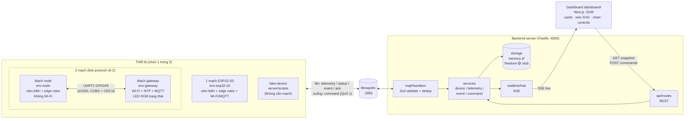
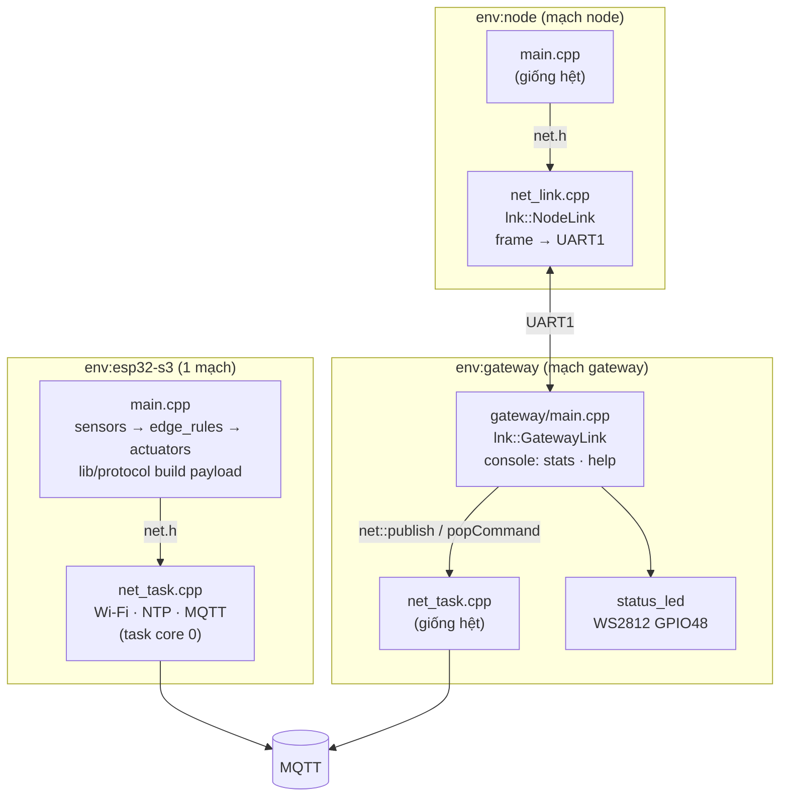
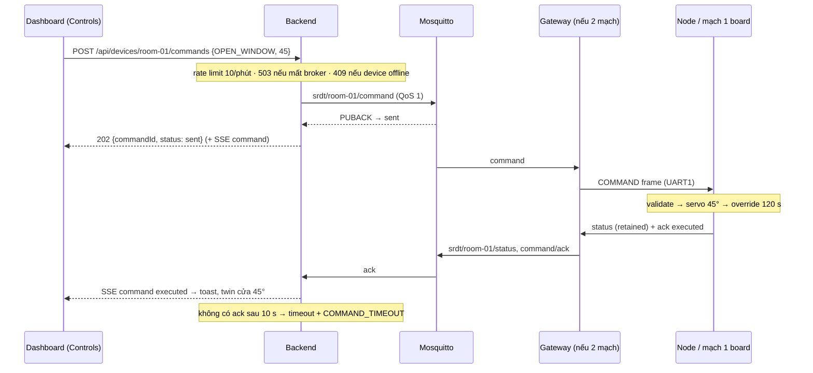

# Kiến trúc & luồng tín hiệu

Tài liệu này mô tả project **đang trông như thế nào** (2026-09-30). Các sơ đồ viết bằng Mermaid, hiện thành hình
trên GitHub và trên VS Code (preview Markdown, hoặc extension *Markdown Preview Mermaid Support*).
Cách chạy: [`README.md`](../README.md). Link giữa 2 mạch: [`link-protocol.md`](link-protocol.md). Phần cloud:
[`cloud.md`](cloud.md).

## 1. Toàn cảnh



Một câu: **thiết bị tự quyết định** (edge rules chạy trên ESP32, kể cả khi mất mạng), MQTT chuyển số liệu lên,
backend validate và giữ "twin", dashboard chỉ **phản chiếu** và gửi lệnh qua backend. `@srdt/contracts`
(`packages/contracts`) là schema chung cho mọi message MQTT và mọi dữ liệu backend ⇄ dashboard.

| Thành phần | Vai trò | Nguồn sự thật cho |
|---|---|---|
| Device (`device/`) | Đọc cảm biến, **tự quyết định** trạng thái (edge rules) và điều khiển LED/buzzer/servo/LCD | edge state, actuator |
| Broker (Mosquitto) | Trung chuyển MQTT; giữ `status` retained + LWT | — |
| Backend (`server/`) | Client MQTT duy nhất được gửi lệnh; validate bằng `@srdt/contracts`; presence; vòng đời command; phát live cho dashboard | presence, trạng thái command |
| Storage (`server/src/storage/`) | Lưu device / telemetry (đã downsample) / event / command. Hiện: RAM | lịch sử |
| Dashboard (`dashboard/`) | Chỉ hiển thị (mirror) và gửi lệnh qua backend | — |

"Digital twin" ở đây = `DeviceRecord.reported` (status mới nhất thiết bị báo lên) + telemetry mới nhất.
Dashboard không bao giờ tự giả định actuator đã đổi: nó chờ status/ack thật từ thiết bị.

## 2. Trạng thái từng phần

| Phần | Trạng thái |
|---|---|
| Firmware 1 mạch (`env:esp32-s3`) | ✅ chạy trong Wokwi |
| Firmware 2 mạch (`env:node` + `env:gateway`) | ✅ chạy trong Wokwi (2 mạch nối nhau qua `splice`); 🟡 chưa chạy trên mạch thật (M3) |
| Link protocol v0.2 (`device/lib/link`, `tools/link-sim`) | ✅ đã chốt, 100 test firmware native + 23 test link-sim |
| Contracts, backend (MQTT ingest, presence, command round trip, REST + SSE) | ✅ 27 + 8 test |
| Dashboard nguồn `backend` | ✅ |
| Storage `firestore`, dashboard nguồn `firestore`, Firebase Hosting, Cloud Run | 🟡 stub / mock, chờ team cloud |
| Auth, TLS broker | ❌ chưa làm (chỉ chạy LAN/local) |

## 3. Bản đồ code

```
smart-room-digital-twin/
├─ device/                          Firmware ESP32-S3 (PlatformIO, Arduino core 2.0.17)
│  ├─ platformio.ini                env: esp32-s3 · node · gateway · node-wokwi · gateway-wokwi · native
│  ├─ secrets.ini.example           Wi-Fi + IP broker cho env:gateway (copy → secrets.ini, gitignored)
│  ├─ include/config.h              mọi hằng số: pin, ngưỡng, timing, Wi-Fi/MQTT mặc định (Wokwi)
│  ├─ src/
│  │  ├─ main.cpp                   loop của mạch có cảm biến (1 mạch / node): sensors → rules → actuators
│  │  ├─ sensors.* actuators.* display.*   phần cứng: DHT22, LDR, pot, PIR, nút, servo, buzzer, LED, LCD
│  │  ├─ net.h                      interface uplink chung cho main.cpp
│  │  ├─ net_task.cpp               uplink Wi-Fi + NTP + MQTT (task core 0) — dùng ở esp32-s3 và gateway
│  │  ├─ net_link.cpp               uplink qua UART1 tới gateway — chỉ env:node
│  │  ├─ console_tee.cpp            chép console lên link (chỉ bản *-wokwi)
│  │  └─ gateway/                   main.cpp (bridge UART ⇄ MQTT) + status_led.* (WS2812)
│  ├─ lib/edge_rules/               smoothing, DHT fault, state machine, override, format LCD (C++ thuần)
│  ├─ lib/protocol/                 build payload §5, parse command (C++ thuần)
│  ├─ lib/link/                     frame COBS+CRC16, message, NodeLink, GatewayLink (C++ thuần)
│  ├─ test/                         Unity test chạy trên PC (pio test -e native)
│  ├─ diagram.json, wokwi.toml      mạch 1 board trong Wokwi
│  └─ wokwi/node/, wokwi/gateway/   mạch node / gateway trong Wokwi (RFC 2217 :4002 / :4001)
├─ broker/                          mosquitto.conf (127.0.0.1) · mosquitto-lan.conf (0.0.0.0, cho mạch thật)
├─ packages/contracts/              @srdt/contracts: Zod schema MQTT + kiểu dữ liệu backend ⇄ dashboard
├─ server/                          @srdt/server: Fastify + mqtt.js
│  ├─ src/mqtt/                     client, topics, handlers (validate + dedup)
│  ├─ src/{devices,telemetry,events,commands}/   service từng loại dữ liệu
│  ├─ src/realtime/hub.ts           fan-out SSE
│  ├─ src/api/routes.ts             REST
│  ├─ src/storage/                  types.ts (interface) · memory/ ✅ · firestore/ 🟡
│  └─ scripts/fake-device.ts        thiết bị giả qua MQTT
├─ tools/link-sim/                  @srdt/link-sim: fake-gateway · fake-node · splice (serial / TCP / RFC 2217 / MQTT tunnel)
├─ dashboard/                       @srdt/dashboard: Next.js 16 static export
│  ├─ src/components/               Dashboard, ValueCards, RoomTwin (SVG), TrendCharts, Controls, EventList…
│  ├─ src/hooks/useTwin.ts          snapshot + stream → state
│  └─ src/lib/datasource/           backend-sse ✅ · firestore 🟡
├─ cloud/                           firebase/ (Hosting, rules, indexes) · gcp/Dockerfile.server — mock
└─ docs/                            architecture (file này) · link-protocol · cloud · reference/spec gốc
```

## 4. Firmware: 1 mạch và 2 mạch dùng chung code

Cùng một `main.cpp` chạy trên mạch 1 board và trên mạch node; chỉ phần **uplink** (`net.h`) đổi, do
`build_src_filter` trong `platformio.ini` chọn:



Gateway **không hiểu** payload: nó chuyển nguyên JSON của node lên đúng topic, và chuyển command xuống. Gateway
tự lo: HELLO/đăng ký node, HEARTBEAT (node im 5 s thì gửi; 15 s không thấy gì → node lost, gateway publish
`status {online:false}` thay node), TIME (node không có NTP), và LED:

| LED gateway | Nghĩa |
|---|---|
| 🔴 đỏ | chưa có Wi-Fi |
| 🟡 vàng | có Wi-Fi, chưa có MQTT |
| 🟢 xanh | MQTT lên |
| nháy 1 Hz (cùng màu) | chưa có node / mất node |

Chi tiết frame, message, luồng: [`link-protocol.md`](link-protocol.md).

### Phần cứng mạch node (giống mạch 1 board, `device/diagram.json`)

| Linh kiện | Chân | Ghi chú |
|---|---|---|
| DHT22 (nhiệt độ, độ ẩm) | GPIO15 | |
| LDR module (ánh sáng) | GPIO1 (ADC1) | |
| Biến trở (giả lập chất lượng không khí) | GPIO2 (ADC1) | |
| PIR (chuyển động) | GPIO16 | |
| Nút nhấn | GPIO17 | INPUT_PULLUP, nhấn = LOW |
| Servo (cửa sổ, 0–90°) | GPIO18 | |
| Buzzer | GPIO21 | |
| LED xanh / vàng / đỏ | GPIO38 / 39 / 40 | |
| LCD 1602 I2C (0x27) | SDA GPIO8, SCL GPIO9 | |
| Link UART1 (chỉ 2 mạch) | RX GPIO4, TX GPIO5 | nối chéo với gateway + chung GND |

## 5. Các cách chạy khi dev: thay phần nào bằng đồ giả

Mỗi người chỉ cần phần mình làm; phần còn lại có bản giả trong `server/scripts` và `tools/link-sim`:

```mermaid
flowchart TB
    subgraph F2["F. 2 mạch thật (M3)"]
        RN["node"] <-->|"dây UART"| RG["gateway"] -- "Wi-Fi LAN" --> BF[("broker<br/>mosquitto-lan.conf")]
    end
    subgraph E["E. 2 mạch Wokwi"]
        WN2["node-wokwi :4002"] <--> SP["splice"] <--> WG2["gateway-wokwi :4001"] --> BE[("broker")]
    end
    subgraph D2["D. Làm mạch gateway"]
        FN["fake-node"] <--> WG["gateway<br/>(Wokwi :4001 hoặc thật)"] --> BD[("broker")]
    end
    subgraph C["C. Làm mạch node"]
        WN["node<br/>(Wokwi :4002 hoặc thật)"] <--> FG["fake-gateway"] --> BC[("broker")]
    end
    subgraph B["B. 1 mạch Wokwi"]
        W1["Wokwi<br/>esp32-s3"] -- "host.wokwi.internal" --> BB[("broker")]
    end
    subgraph A["A. Không có mạch"]
        FD["fake-device"] --> BA[("broker")]
    end
```



Backend + dashboard giống hệt ở mọi cách: chúng chỉ thấy topic MQTT `srdt/room-01/...`.

| Cổng | Dùng cho |
|---|---|
| 1883 | Mosquitto |
| 4000 | backend (REST + SSE) |
| 3100 | dashboard dev |
| 4001 | Wokwi gateway: link UART qua RFC 2217 |
| 4002 | Wokwi node: link UART qua RFC 2217 |
| 7000 | fake-gateway ⇄ fake-node qua TCP (mặc định của link-sim) |

## 6. Topic MQTT (prefix `srdt`, §6.2)

| Topic | Hướng | QoS / retain | Payload (`packages/contracts`) |
|---|---|---|---|
| `srdt/{id}/telemetry` | device → backend | 0 | `Telemetry`, mỗi 2 s + ngay khi đổi state |
| `srdt/{id}/status` | device → backend | 1, retained | `StatusOnline` khi đổi + mỗi 30 s; LWT `{online:false}` |
| `srdt/{id}/event` | device → backend | 0 | `DeviceEvent` (BOOT, STATE_CHANGED, OVERRIDE_SET…) |
| `srdt/{id}/command` | backend → device | 1 | `CommandMessage` |
| `srdt/{id}/command/ack` | device → backend | 0 | `CommandAck` |

Đổi prefix: `MQTT_TOPIC_PREFIX` ở **cả** `device/include/config.h` và `server/.env`.

## 7. Uplink: thiết bị → dashboard

```
MQTT message
  → server/src/mqtt/handlers.ts   topic → size ≤ 1 KB → JSON → Zod → deviceId khớp topic → dedup (bootId, seq)
  → DeviceService.touch            presence online (retained/LWT không tính), DEVICE_ONLINE event
  → theo loại:
      telemetry → TelemetryService   hub.publish (mọi message) + storage.telemetry.append (downsample 5 s / đổi state)
      status    → DeviceService      reported state + override.expiresAt → hub + storage.devices.put
      event     → EventService       hub + storage.events.append
      ack       → CommandService     transition pending|sent → executed|rejected|failed → hub
  → RealtimeHub (SSE) → dashboard useTwin() reducer → component
```

Offline: LWT (~20–25 s sau khi device chết) hoặc 45 s không có dữ liệu (sweep 10 s) → `DEVICE_OFFLINE`.
Với 2 mạch: mất dây link → sau 15 s gateway publish `status {online:false}` thay node.

## 8. Downlink: dashboard → thiết bị (§6.6)



Mọi đổi trạng thái command là **compare-and-set** (`CommandStore.transition`), nên ack đến trước PUBACK
vẫn giữ `executed`, và ack trễ không ghi đè `timeout`. Mạch 1 board thì bỏ bước gateway.

## 9. Chỗ cắm cho phần cloud

```
server/src/storage/
  types.ts                 ← interface duy nhất services dùng (DeviceStore, TelemetryStore, EventStore, CommandStore)
  memory/                  ← driver đang dùng
  firestore/               ← stub, STORAGE_DRIVER=firestore
dashboard/src/lib/datasource/
  types.ts                 ← TwinSource: subscribe(code) → StreamMessage
  backend-sse.ts           ← đang dùng
  firestore.ts             ← placeholder, NEXT_PUBLIC_DATA_SOURCE=firestore
cloud/firebase/            ← firebase.json (Hosting → dashboard/out), firestore.rules, indexes (mock)
cloud/gcp/                 ← Dockerfile backend cho Cloud Run / VM (mock)
```

Chi tiết: [`cloud.md`](cloud.md).
